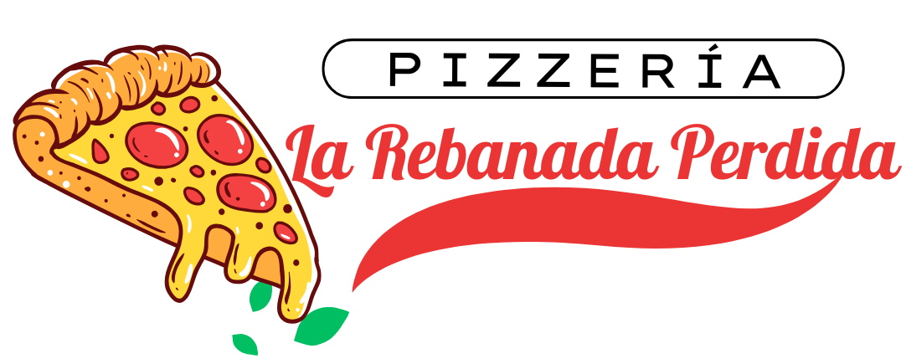
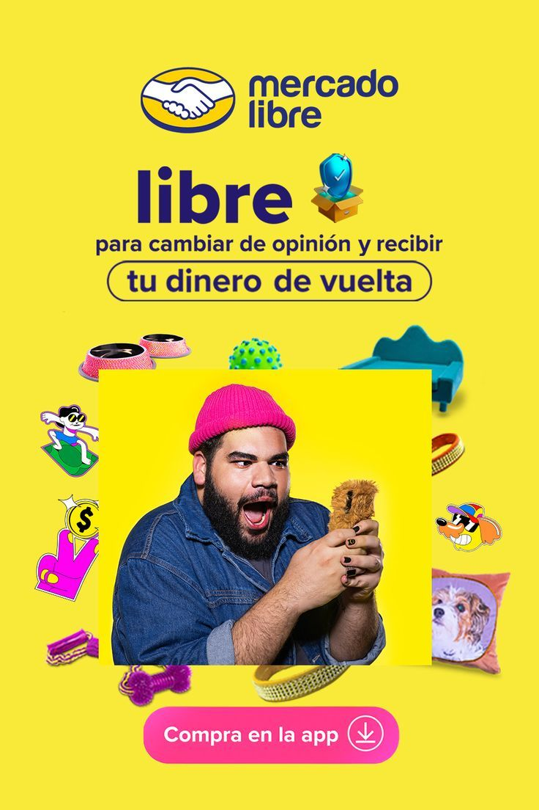

<html>
<head>
	<meta charset="utf-8">
	<meta name="viewport" content="width=device-width, initial-scale=1">
	<title>Pizzería "La Rebanada Perdida"</title>
	
</head>
<body>
	

		<h1>Pizzería "La Rebanada Perdida"</h1>
		
¡Busca tu rebanada perdida en nuestra sucursal!

	

	

		<a href="menupizza_caballero.html">Menú</a> 
		<a href="promociones_caballero.html">Promociones</a> 
		<a href="pedidos_caballero.html">Pedidos</a>
		<a href="pizza_caballero.html" style="float:right">Inicio</a>
	

	

		

			

				

					
¡Haz tu pedido con nosotros!

					
En tiempo, calidad y excelente sabor... ¡Solo nosotros somos los mejores!
 
				
 
		

		

			

				<h2>Nosotros</h2>
				

									
 
				
Somos una empresa 100% jarocha, creada por una universitaria
 
			
 
			

				

					
				

			

			

				<h3>Siguenos en nuestras redes sociales</h3>
				
<strong>Faceboook:</strong> La Rebanada Perdida <strong>Instagram:</strong> @larebanadaperdida

			

		

	

	
 
		<h3>Sitio web</h3>
		<h4>Proyecto Final para la clase de Desarrollo Web</h4>
	

</body>
</html>
